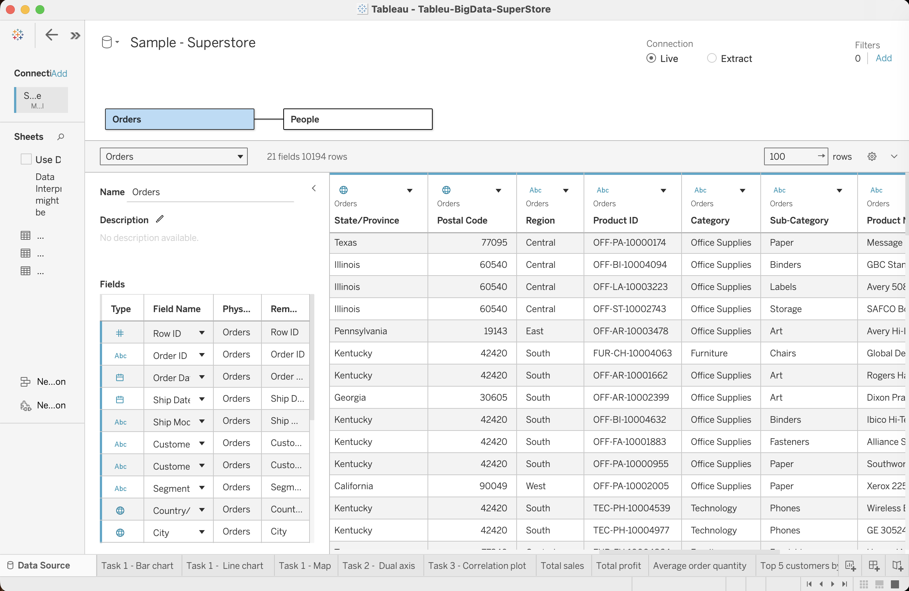
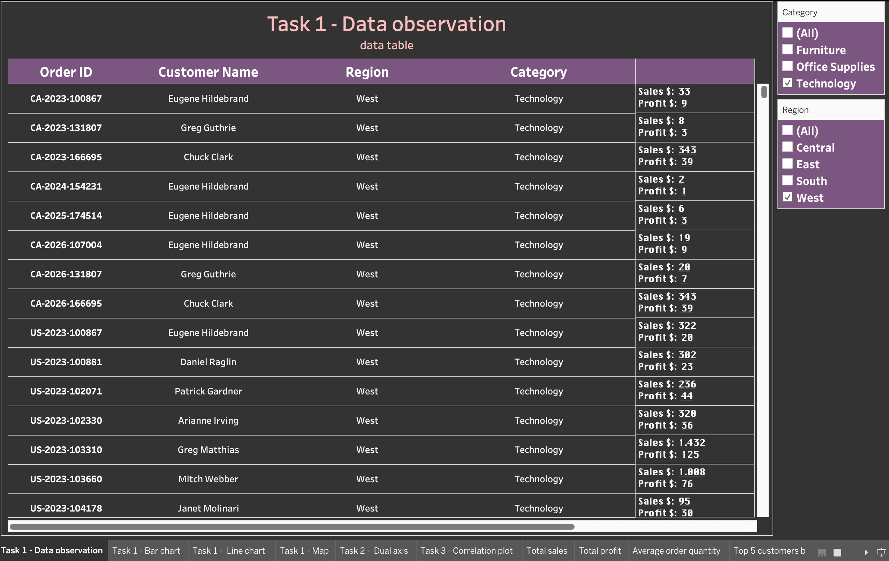
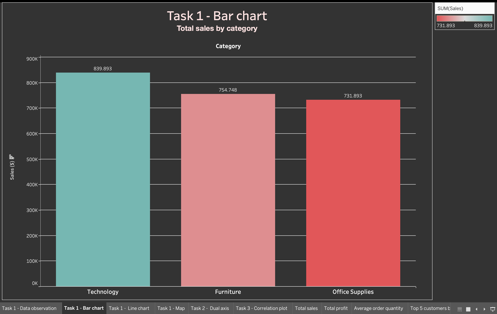
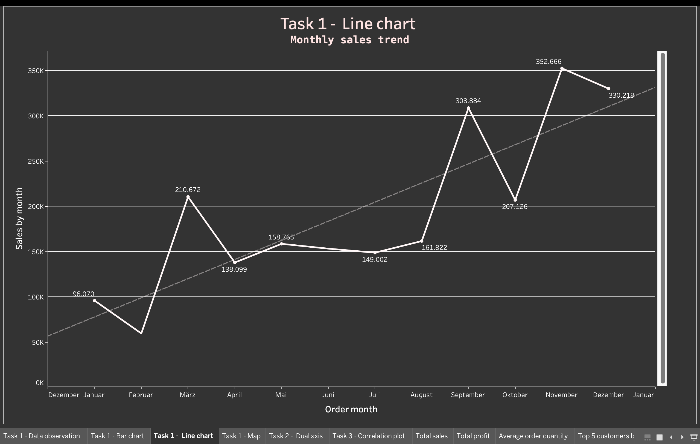
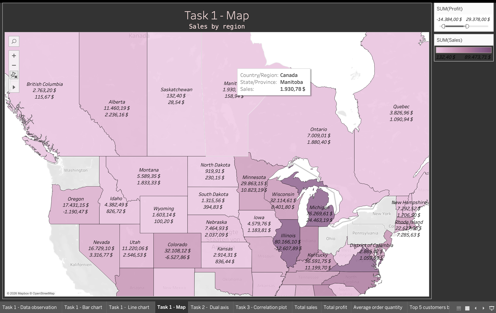
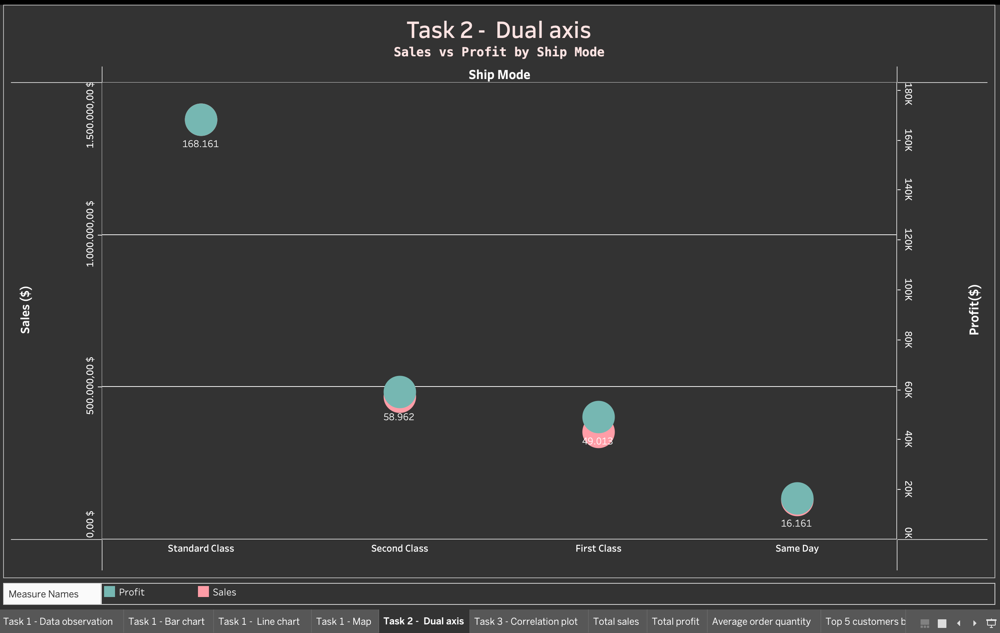
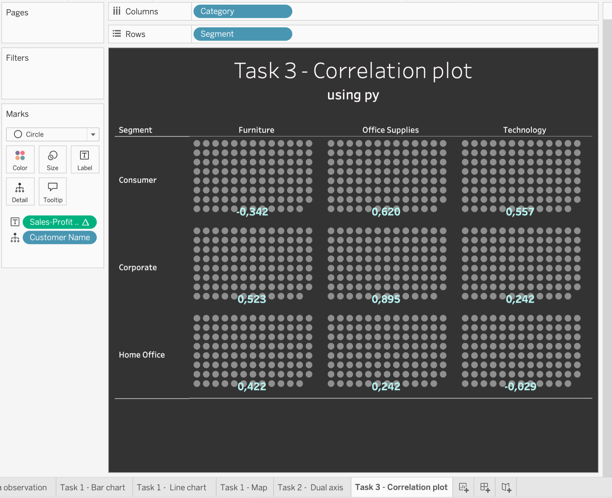
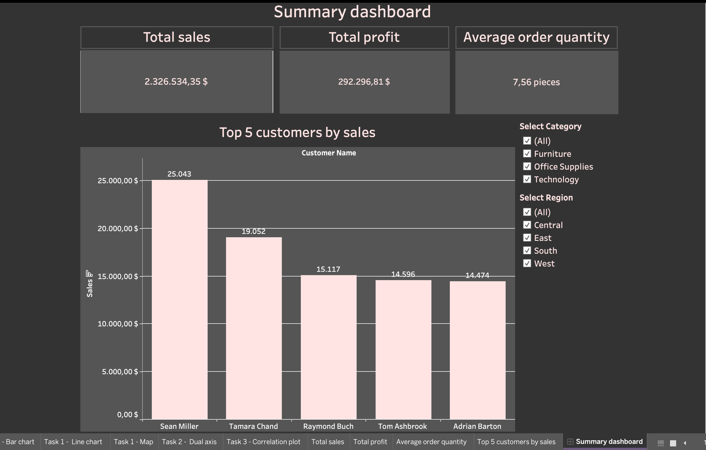

# 📊 Tableau Superstore Data Analysis Project
This project presents an in-depth data analysis of the Sample Superstore dataset using Tableau with integration of TabPy (Python) for advanced analytics. The goal is to explore sales performance, profitability, customer behavior, and regional trends through interactive visualizations and dashboards.

## 📁 Project Overview
The analysis was conducted in Tableau and includes multiple stages:
Data preparation and joining of Superstore tables (orders, customers, regions)
Data validation and checking of data types
Creation of multiple visual sheets for analysis
Development of interactive dashboards
Integration with TabPy for correlation analysis using Python: 

## 📊 Key Analyses Performed
### 1. Data Overview
Built a structured table including Order ID, Customer Name, Region, Category, Sales, and Profit
Applied filters for Region and Category for better exploration
Identified differences between dimensions and measures in Tableau
Analyzed continuous vs discrete fields and their impact on visualization: 

### 2. Sales by Category
Compared sales across Furniture, Office Supplies, and Technology
Sorted data in descending order for clarity
Applied formatting, labels, and currency settings
Identified Technology as the leading category in sales performance: 

### 3. Time Series Analysis
Converted Order Date into continuous monthly format
Created sales trend visualization
Added trend line for forecasting insights
Identified seasonal peaks in sales (March, September, November): 

### 4. Geographic Analysis
Built a map visualization using Country and State fields
Used color intensity to represent sales values
Added profit-based filtering
Highlighted high-performing US regions such as California, New York, Washington, and Michigan: 

### 5. Shipping Mode Analysis
Compared sales and profit across different shipping modes
Used dual-axis visualization for deeper comparison
Created calculated field for average profit per order
Identified Standard Shipping as the most used and most profitable method

### 6. TabPy Correlation Analysis
Connected Tableau with Python (TabPy)
Created calculated fields for correlation between Sales and Profit
Analyzed relationships across segments and categories
Found strong correlation in Corporate segment (up to 0.96) and weak/negative correlation in others

### 7. Dashboard Creation
Combined multiple sheets into a single interactive dashboard
Added filters for Region and Category
Configured layout for desktop view (1000x800)
Built an overview of total sales, profit, and top customers

## 📈 Key Insights
* Technology category has the highest sales performance
* Standard shipping is the most frequently used delivery method
* Sales and profit vary significantly across segments
* Strong regional concentration of profit in the United States
* Clear seasonal trends with recurring peaks during specific months
* Correlation between sales and profit varies from strong to weak depending on segment

## 🛠 Tools Used
Tableau Desktop
TabPy (Python integration)
Superstore dataset

## 📷 Visualizations
All dashboards, charts, and maps are included in the /images folder of this repository.

## 📚 References
Karbasi, G. (2024) Tableau & TabPy – Datenanalyse mit Python. SVA Focus.
https://focus.sva.de/big-data-analytics/tableau-tabpy-datenanalyse-mit-python/

## 🚀 Conclusion
This project demonstrates how Tableau combined with Python integration can be used to transform raw data into meaningful business insights. The analysis highlights key performance drivers and supports data-driven decision-making.
